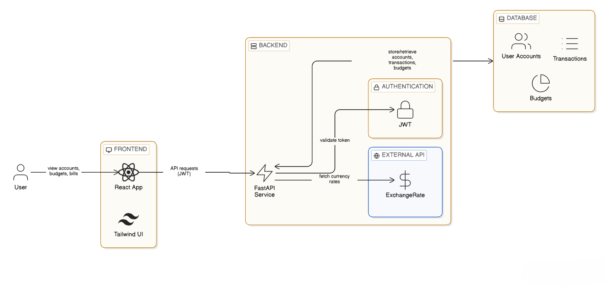

# 💳 Modern Digital Banking Dashboard

> A scalable full-stack fintech platform for intelligent personal finance management


---

## 🌐 Live Deployment

| Service | URL |
|---|---|
| 🖥 Frontend (Vercel) | [modern-digital-banking-dashboard-three.vercel.app](https://modern-digital-banking-dashboard-three.vercel.app/login) |
| ⚡ Backend API (Render) | [modern-digital-banking-dashboard-hto6.onrender.com](https://modern-digital-banking-dashboard-hto6.onrender.com) |
| 📘 API Docs (Swagger) | [/docs](https://modern-digital-banking-dashboard-hto6.onrender.com/docs) |

---

## 🚀 Overview

The **Modern Digital Banking Dashboard** is a production-oriented personal finance platform that centralizes:

- 🏦 Multi-account management
- 💳 Transaction tracking & categorization
- 📊 Budget planning
- 📅 Bill monitoring with automated reminders
- 🎁 Rewards tracking
- 📈 Financial insights & alerts

---

## 🏗️ System Architecture

```
┌────────────────────────────────────┐
│       React Frontend (Vercel)      │
│  Dashboard │ Accounts │ Budgets    │
└──────────────────┬─────────────────┘
                   │ REST API · JWT Auth
┌──────────────────┴─────────────────┐
│      FastAPI Backend (Render)      │
│  Auth │ Accounts │ Txns │ Celery   │
└──────────────────┬─────────────────┘
                   │ SQLAlchemy ORM
┌──────────────────┴─────────────────┐
│    PostgreSQL Database (Render)    │
│  Users │ Accounts │ Transactions   │
└────────────────────────────────────┘
```
### 📊 Visual Architecture




- **Frontend** communicates with FastAPI via CORS-restricted REST endpoints
- **FastAPI** handles authentication, business logic, and data validation
- **PostgreSQL** stores all relational financial data
- **Celery** manages background bill reminders and alert generation

---

## ✨ Core Features

### 🔐 Authentication & User Management
- Secure registration & login with JWT-based access tokens
- Password hashing before storage
- User-level data isolation

### 🏦 Accounts & Transactions
- Support for multiple account types (Savings, Credit Card, Loan, etc.)
- CSV-based transaction ingestion
- Transaction filtering & detailed views
- Manual and rule-based expense categorization
- Dynamic account balance calculations

### 📊 Budget Management
- Monthly category-wise budget creation
- Automatic spent vs. remaining calculations
- Budget progress visualization
- Overspending detection alerts

### 📅 Bills & Reminders
- Full CRUD operations for bills
- Automatic status updates — `upcoming` / `overdue` / `paid`
- Background job reminders powered by Celery
- Visual urgency indicators

### 🎁 Rewards & Currency Insights
- Rewards program tracking & points balance monitoring
- Currency conversion powered by external exchange rate API integration
- Multi-currency visibility across accounts

### 📈 Financial Insights & Alerts
- Cash flow overview
- Top spending merchants
- Monthly burn rate analysis
- Low balance & budget exceeded notifications

---

## 🛠️ Technology Stack

| Layer | Technologies |
|---|---|
| **Frontend** | React.js, Tailwind CSS, Axios, React Router |
| **Backend** | FastAPI, SQLAlchemy ORM, PostgreSQL, Celery |
| **Auth** | JWT Tokens, Password Hashing, CORS Middleware |
| **Deployment** | Vercel (Frontend), Render (Backend + DB) |

---

## 📁 Project Structure

```
modern-digital-banking-dashboard/
│
├── frontend/
│   ├── src/
│   │   ├── api/
│   │   ├── components/
│   │   ├── pages/
│   │   └── utils/
│   └── package.json
│
├── backend/
│   ├── app/
│   │   ├── models/
│   │   ├── routes/
│   │   ├── schemas/
│   │   ├── core/
│   │   └── services/
│   ├── main.py
│   └── requirements.txt
│
└── README.md
```

---

## 🚀 Local Development Setup

### Prerequisites
- Python 3.11+
- Node.js 18+
- PostgreSQL 15

### Backend

```bash
cd backend
python -m venv venv
source venv/bin/activate       # Windows: venv\Scripts\activate
pip install -r requirements.txt
uvicorn main:app --reload
```

> API docs available at `http://localhost:8000/docs`

### Frontend

```bash
cd frontend
npm install
npm run dev
```

> App available at `http://localhost:3000`

---

## 🔐 Security

- ✅ Password hashing before storage
- ✅ JWT token validation on all protected routes
- ✅ CORS middleware configuration
- ✅ Environment-based secrets management
- ✅ Per-user data isolation

---

## 🏭 Production Considerations

- Stateless JWT-based authentication
- Background job isolation using Celery workers
- Environment-specific configuration (development vs production)
- Secure environment variable management via hosting platforms
- Scalable modular backend architecture

---

## 🗺️ Roadmap

### ✅ Completed
- [x] Authentication module
- [x] Accounts & transactions
- [x] Budget tracking
- [x] Bill management
- [x] Rewards module
- [x] Insights & alerts

### 📅 Planned
- [ ] Plaid API & Open Banking integration
- [ ] Exportable financial reports (PDF)
- [ ] Advanced analytics dashboard
- [ ] Admin monitoring module

---

## 🎯 What This Project Demonstrates

- Full-stack application architecture design
- Secure authentication implementation using JWT
- Relational database modeling for financial data
- Background task processing with Celery
- Cloud deployment using Vercel & Render
- Separation of concerns in scalable REST APIs

---

## 👨‍💻 Author

**Anukalp Tejaswi** — B.Tech · Backend & Python Developer
